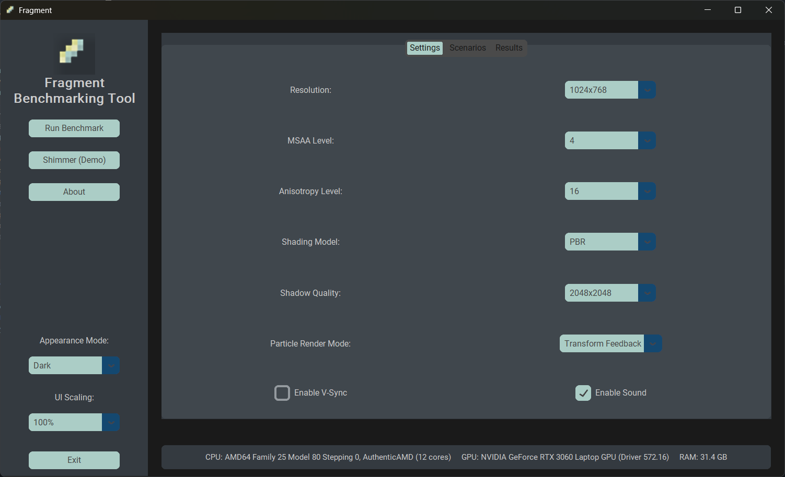
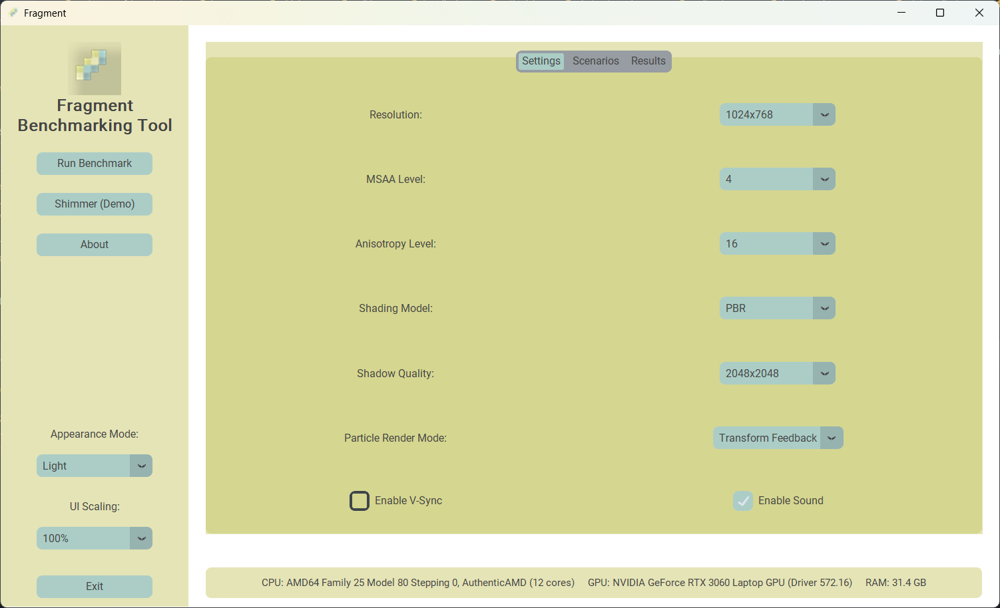
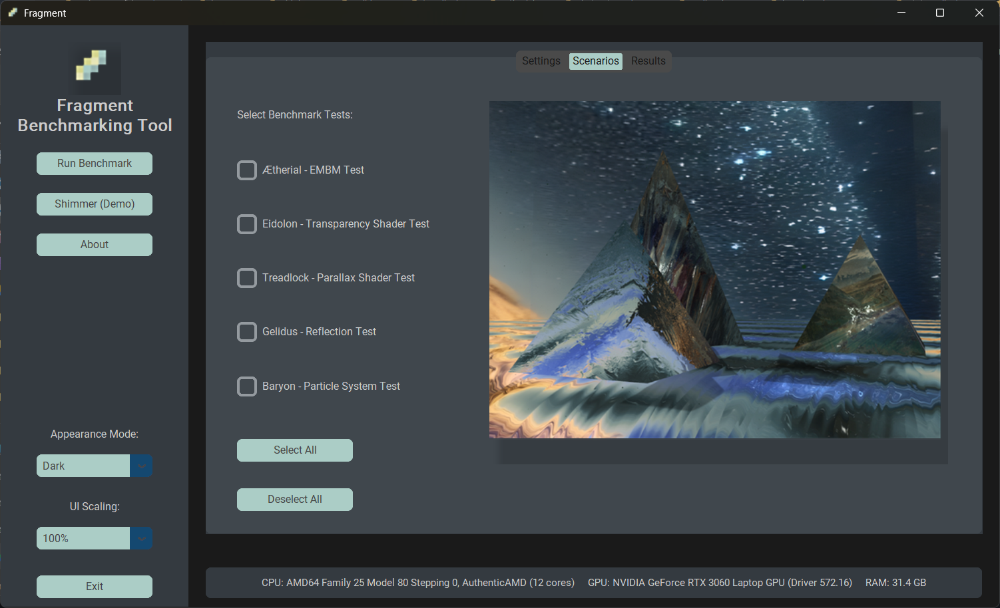
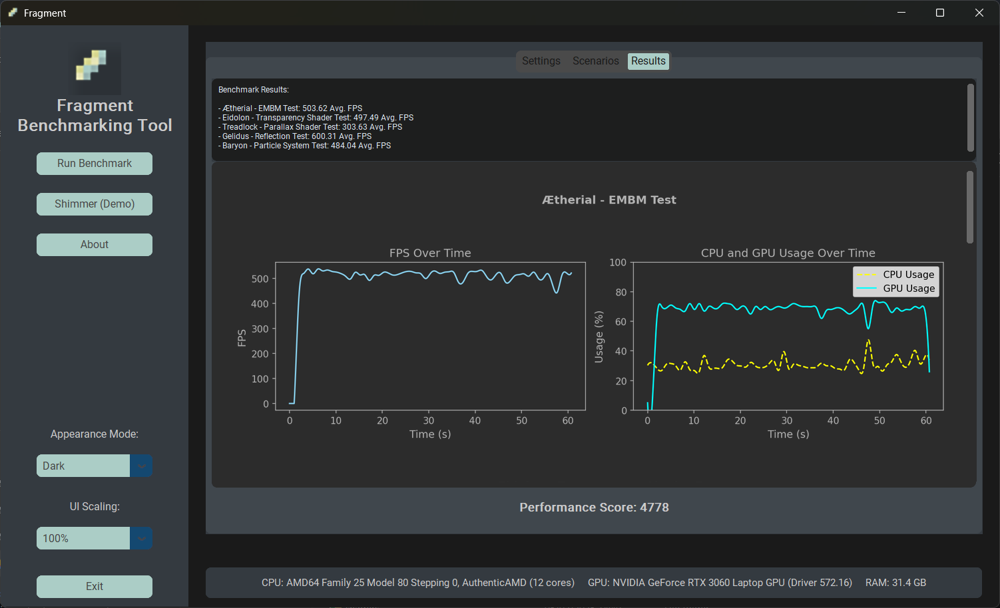
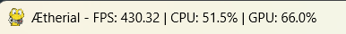

# Fragment

Fragment is an advanced 3D rendering benchmark tool (inspired by 3DMark) for PCs and Raspberry Pi (4 and above on
Bookworm working during my testing). It leverages OpenGL (
via PyOpenGL and Pygame) to stress-test hardware performance, with a clean graphical interface and multiple benchmark
modes.

View the full write-up on [Hackster](https://www.hackster.io/314reactor/fragment)
and [Electromaker](https://www.electromaker.io/project/view/fragment)

## Features

### Benchmark Modes

1. **Shimmer** – A demo combining multiple features, including particle effects and ambient audio.  
   

2. **Ætherial** – EMBM shader test using a pyramid model.  
   

3. **Eidolon** – Transparency and planar camera via EMBM shaders on spherical models.  
   

4. **Treadlock** – Parallax mapping test with a spotlight on a detailed tire model.  
   

5. **Gelidus** – Reflection test using cubemap-reflective water surfaces.  
   

6. **Baryon** – Particle system benchmark supporting CPU, Transform Feedback, and Compute Shader modes.  
   

### User Interface

  


- Select benchmarks, configure settings, and preview scenarios.
- Tune graphical settings, including MSAA, anisotropy, shading models, and resolution.
- View performance results with clean matplotlib charts.

  
  

- Track FPS, CPU, and GPU usage in the window title bar in real-time.



### Rendering & Performance

- **Rendering:** Diffuse, Phong, and PBR shading; parallax and shadow mapping.
- **Performance Tracking:** Real-time FPS, CPU, and GPU usage displayed in the window title bar.
- **Graphical Settings:** Adjustable resolution, MSAA, anisotropic filtering, shading models, and shadow quality.
- **Performance Score:** Aggregated FPS-based performance rating across benchmarks.

### Architecture

- **Abstract Renderer:** Manages shaders, textures, cubemaps, camera controls, and lighting.
- **Benchmark Construction:** Easily integrate model, surface, particle, and skybox-based benchmarks.

## Installation

### Prerequisites

- Python 3.10+
- Dependencies: PyOpenGL, Pygame, Matplotlib, NumPy, Pillow, psutil, GPUtil, CustomTkinter
- **Note:** `PyOpenGL-accelerate` is excluded on ARM systems due to Raspberry Pi compatibility:
  ```sh  
  PyOpenGL-accelerate==3.1.7; "arm" not in platform_machine and "aarch" not in platform_machine  
  ```

### Setup

Clone and install dependencies:

```sh  
git clone https://github.com/LordofBone/fragment.git  
cd fragment  
pip install -r requirements.txt  
```

#### Raspberry Pi Configuration

```sh  
chmod +x setup/rpi_setup.sh && ./setup/rpi_setup.sh  
chmod +x setup/rpi_bashrc_setup.sh && ./setup/rpi_bashrc_setup.sh  
```

`rpi_setup.sh` installs libosmesa6 and configures the PYOPENGL_PLATFORM and MESA_GL_VERSION_OVERRIDE envvars for
Fragment to work on the Raspberry Pi.

`rpi_bashrc_setup.sh` adds the necessary environment variables to the `.bashrc` file for Fragment to work on the
Raspberry Pi.

Sometimes just running rpi_setup.sh is enough, but if you're having trouble, try running rpi_bashrc_setup.sh as well.

## Usage

**Caution:** Fragment can be quite heavy on systems like the Raspberry Pi and may cause excessive heat buildup,
especially on the GPU. Ensure adequate cooling is in place, and use at your own risk.

Run the benchmark tool:

```sh  
python main.py  
```

Within the GUI, you can:

- Select and configure benchmark tests.
- Adjust settings such as MSAA, anisotropy, shading models, and resolution.
- Track live performance data and view overall results in Matplotlib charts.

**Note:** The results from Fragment should not be taken as totally accurate.  
The performance score is more of a "finger in the air" number at the moment, based on:  
`performance_score = overall_avg_fps * 10`.

Overall, Fragment is still a work-in-progress (WiP), so results may vary even  
upon different runs of the same benchmarks.

## Testing

Fragment includes a headless test suite using `unittest` and `pytest` to validate core functionality, including:

- Configuration parsing and renderer operations.
- Camera interpolation and performance data collection.
- Benchmark execution, audio playback, and GUI logic.

### Running Tests

To execute the test suite and generate an HTML report under the `/report` directory, run:

```sh  
pytest --html=report/report.html  
```

Alternatively, use `unittest` (no report generated):

```sh  
python -m unittest discover -s tests  
```

The generated HTML report provides a structured overview of test results for easier debugging.

## Known Issues

- **Raspberry Pi Compatibility:** Fragment may not work on all Raspberry Pi models or OS versions due to OpenGL
  limitations, as mentioned it works on RPi 4 and above on Bookworm.  
  Use the provided setup scripts to ensure compatibility with Raspberry Pi (Bookworm).

- **Memory Leaks:** There may be memory leaks, particularly on Raspberry Pi.  
  Running benchmarks repeatedly (especially the demo) can cause out-of-memory issues.  
  These will be investigated and addressed over time.

- **Particle System:**
   - Particles are locked to the camera position, causing them to move with it.
   - In CPU mode, particles spawn in a different location compared to other modes.
   - Ground plane rotation for particles does not always work as expected.
   - **Raspberry Pi (Bookworm):** Particles do not render identically to the PC version and appear visually different.
   - **Raspberry Pi (Bookworm):** Only `GL_POINTS` works for particle rendering; other primitive types fail under
     `glDrawArrays`.

- **Graphics Limitations (Raspberry Pi):**
   - 8× MSAA is unsupported due to GPU limitations.
   - Compute Shader mode does not function on Raspberry Pi.

- **Tone Mapping & Gamma Correction:**  
  These functions currently do not work, resulting in a washed-out image.  
  All lighting is currently rendered in SDR.

- **Performance Score:** The calculated performance score is an approximation and may not accurately represent system
  performance.

- **GUI Behavior (Raspberry Pi - Bookworm):** After running the demo, the GUI incorrectly navigates to the results
  screen instead of returning to the current tab.

## Adding New Benchmarks

Fragment allows users to create and integrate custom benchmark scenarios. This guide provides a quick overview of adding
new benchmarks, configuring them, and ensuring they appear correctly in the GUI.

---

### 1. Creating a Benchmark Script

All benchmarks are stored under the `/benchmarks/` directory. Each benchmark should have a separate Python script
implementing its logic.

#### Example Structure:

Create a new benchmark script `my_new_benchmark.py` inside `/benchmarks/`. The script should define a `run_benchmark`
function, similar to the **Shimmer (Demo)** scenario:

## Example Benchmark Script

This example demonstrates how to create a new benchmark scenario using **Fragment**. The script sets up a **rotating
pyramid model** with **ambient lighting, shadows, and background audio**.

```python  
import os
from components.renderer_config import RendererConfig
from components.renderer_instancing import RenderingInstance
from config.path_config import (
    diffuse_textures_dir,
    normal_textures_dir,
    displacement_textures_dir,
    models_dir,
    audio_dir,
)


def run_benchmark(
        stats_queue=None,
        stop_event=None,
        resolution=(800, 600),
        msaa_level=4,
        anisotropy=16,
        lighting_mode="pbr",
        shadow_map_resolution=2048,
        particle_render_mode="vertex",
        vsync_enabled=True,
        sound_enabled=True,
        fullscreen=False,
):
    # Initialize base configuration for the renderer  
    base_config = RendererConfig(
        window_title="New Benchmark",  # Sets the window title  
        window_size=resolution,  # Defines the resolution (width, height) - passed in as a parameter from GUI
        vsync_enabled=vsync_enabled,  # Enables or disables V-Sync - passed in as a parameter from GUI
        fullscreen=fullscreen,  # Runs the benchmark in fullscreen mode if enabled - passed in as a parameter from GUI
        msaa_level=msaa_level,  # Sets the anti-aliasing level (0, 2, 4, 8) - passed in as a parameter from GUI
        duration=60,  # Benchmark runtime duration (seconds)  

        # Camera configuration  
        camera_positions=[
            (4.5, 2.85, -1.4, 108.0, -24.0),
            # (x, y, z, rotation_x, rotation_y), more positions can be added to create a camera path
        ],
        lens_rotations=[0.0],
        # Adjusts lens roll angle at different keyframes, more rotations can be added to create a camera path
        auto_camera=True,
        # Enables automatic camera movement, which moves the camera through the defined positions from above
        fov=90,  # Field of view (wider values show more of the scene)  
        near_plane=0.1,  # Minimum rendering distance  
        far_plane=1000,  # Maximum rendering distance  

        # Global lighting settings  
        ambient_lighting_strength=0.60,  # Adjusts scene-wide ambient lighting intensity  
        ambient_lighting_color=(0.216, 0.871, 0.165),  # Greenish ambient lighting  

        # Directional light (acts like a sun), multiples can be added; only the first one in the dict is used for shadow mapping
        lights=[
            {
                "position": (50.0, 50.0, 50.0),  # Light source position in world space  
                "color": (0.992, 1.0, 0.769),  # Warm light color (soft yellow)  
                "strength": 0.8,  # Light intensity  
                "orth_left": -100.0,  # Shadow projection bounds (used for shadow mapping)  
                "orth_right": 100.0,
                "orth_bottom": -100.0,
                "orth_top": 100.0,
            },
        ],

        # Rendering settings  
        lighting_mode=lighting_mode,  # "pbr", "phong", or "diffuse" shading models - passed in as a parameter from GUI
        shadow_map_resolution=shadow_map_resolution,
        # Shadow quality (higher = better) - passed in as a parameter from GUI
        shadow_strength=1.0,  # Controls shadow darkness  
        anisotropy=anisotropy,  # Anisotropic filtering for texture sharpness - passed in as a parameter from GUI
        move_speed=0.2,  # Speed of camera movement in auto-camera mode  
        culling=True,  # Enables back-face culling for performance improvement  

        # Audio settings  
        sound_enabled=sound_enabled,  # Enables or disables background audio - passed in as a parameter from GUI
        background_audio=os.path.join(audio_dir, "music/water_pyramid.wav"),  # Path to background music  
        audio_delay=0.0,  # Delays the start of the background audio  
        audio_loop=True,  # Loops the background music continuously  
    )

    # Define a 3D model (Pyramid)  
    model_config = base_config.add_model(
        obj_path=os.path.join(models_dir, "pyramid.obj"),  # Path to 3D model  
        texture_paths={
            "diffuse": os.path.join(diffuse_textures_dir, "metal_1.png"),  # Base color texture  
            "normal": os.path.join(normal_textures_dir, "metal_1.png"),  # Normal map for surface details  
            "displacement": os.path.join(displacement_textures_dir, "metal_1.png"),  # Height map for parallax effects  
        },
        shader_names={
            "vertex": "standard",  # Vertex shader used for geometry transformation  
            "fragment": "embm",  # Fragment shader used for lighting effects (EMBM = Environment-Mapped Bump Mapping)  
        },
    )

    # Create a rendering instance  
    instance = RenderingInstance(base_config)
    instance.setup()

    # Add the pyramid model to the scene  
    instance.add_renderer("main_model", "model", **model_config)

    # Scene transformations for the pyramid model  
    instance.scene_construct.translate_renderer("main_model", (0, 0, 0))  # Moves model to (x, y, z)  
    instance.scene_construct.rotate_renderer("main_model", 45,
                                             (0, 1, 0))  # Rotates model around an axis (degrees, (x, y, z))
    instance.scene_construct.scale_renderer("main_model", (1.2, 1.2, 1.2))  # Scales the model uniformly (x, y, z axis)

    # Enable automatic rotation for the model  
    instance.scene_construct.set_auto_rotation("main_model", True, axis=(0, 1, 0), speed=2000.0)
    # - `True` enables auto-rotation.  
    # - `axis=(0, 1, 0)` means it rotates around the Y-axis.  
    # - `speed=2000.0` determines rotation speed (higher values rotate faster).  

    # Start the benchmark  
    instance.run(stats_queue=stats_queue, stop_event=stop_event)  
```  

---

✅ **Key Features Explained:**

### **Rendering Configuration**

- **Resolution & MSAA:** Defines the screen size and anti-aliasing level.
- **Lighting & Shadows:** Uses ambient and directional lighting, with shadow quality adjustable.
- **Audio Support:** Background music can be looped or disabled via settings.
- **Automatic Camera:** Moves through predefined positions for cinematic views.

### **Scene Manipulation**

- **Translation (`translate_renderer`)** → Moves objects to a specific position.
- **Rotation (`rotate_renderer`)** → Rotates an object around an axis.
- **Scaling (`scale_renderer`)** → Enlarges or shrinks objects uniformly or non-uniformly.
- **Auto-Rotation (`set_auto_rotation`)** → Makes an object continuously rotate.

This guide ensures **clear understanding** of each parameter when adding new benchmarks. 🚀

---

### 2. Registering the Benchmark in the GUI

To add the new benchmark to the menu, modify **`/gui/main_gui.py`** where benchmarks are registered:

```python  
from benchmarks.my_new_benchmark import run_benchmark as run_new_benchmark

BENCHMARKS = {
    "New Benchmark - Example Test": run_new_benchmark,
}  
``` 

✅ **Key Points:**

- Import the new benchmark function.
- Add an entry to the `BENCHMARKS` dictionary.
- Ensure the name is descriptive for clarity.

---

### 3. Adding a Preview Image

To ensure the GUI displays a preview, place a reference image under:

📂 **`/docs/images/`**

- Name the image **exactly** as the benchmark title in the GUI BENCHMARKS dict.
- Example: `"New Benchmark - Example Test.png"`

✅ **Key Points:**

- The image should match the exact benchmark title in the GUI).
- The image is displayed when users hover over the benchmark in the GUI.
- PNG format is preferred.

---

### 4. Running and Testing

After adding the benchmark:

1. **Run it via the GUI:**
    - Start the application (`python main.py`).
    - Navigate to the **Scenarios** tab.
    - Select the new benchmark and run it.

2. **Verify the results:**
    - Ensure FPS, CPU, and GPU usage data are recorded.
    - Check the preview image appears correctly.

---

### 5. Committing and Contributing

If contributing to the main repository:

- **Ensure code passes linting and tests:**
  ```sh  
  pytest --html=report/report.html  
  ``` 

- **Submit a Pull Request:**
    - Fork the repository.
    - Add your benchmark under `/benchmarks/`.
    - Update the GUI and add a preview image.
    - Open a PR with a description of the new benchmark.

---

### Summary

✔️ Create a new benchmark script under `/benchmarks/`.  
✔️ Configure rendering using `RendererConfig`.  
✔️ Register the benchmark in `/main.py`.  
✔️ Add a preview image under `/docs/images/`.  
✔️ Test manually and via the GUI.  
✔️ Ensure code follows standards before submitting a PR.

This workflow ensures new benchmarks are properly integrated and accessible in the GUI for testing and comparison. 🚀

## GitHub Actions & Contribution Workflow

Fragment uses GitHub Actions to automate linting, testing, and version management. These workflows ensure code quality
and maintain a structured versioning system.

### Linting, Formatting, and Testing (`lint_and_test.yml`)

This workflow runs on **every pull request**, ensuring that contributions meet coding standards and pass all tests
before merging.

#### Steps:

1. **Checkout Repository** – Fetches the latest code.
2. **Set Up Python** – Installs Python 3.10.
3. **Install Dependencies** – Installs required development dependencies.
4. **Run Ruff Linting & Formatting** –
    - Lints the code with Ruff and auto-fixes issues.
    - Ensures formatting is correct.
5. **Auto Commit Linting Fixes** – Automatically commits any formatting fixes.
6. **Run Unit Tests** – Executes tests using `pytest` and generates an HTML report (not availabe on GH pages yet).

🔹 *Why this matters:* Contributors must follow consistent coding practices, and all pull requests are automatically
checked before merging.

---

### Automatic Versioning & Tagging (`tag_and_bump_on_merge.yml`)

When a pull request is merged into the `main` branch, this workflow:

#### Steps:

1. **Checkout Repository** – Ensures full commit history is available.
2. **Set Up Python** – Installs Python 3.10.
3. **Install bump2version** – A tool for managing semantic versioning.
4. **Determine Version Bump Level** –
    - Analyzes the number of code changes (`git diff HEAD^`).
    - Determines whether to increment the **patch**, **minor**, or **major** version:
        - **Patch:** Changes < 250 lines.
        - **Minor:** Changes between 250–2000 lines.
        - **Major:** Changes ≥ 2000 lines.
5. **Bump Version** – Updates the version in the codebase accordingly.
6. **Auto Commit Version Update** – Commits the version bump change.
7. **Create a Git Tag** – Uses the updated version number as a tag (e.g., `v1.2.3`).
8. **Push Tag to Repository** – Ensures the new version is officially recorded.

🔹 *Why this matters:*

- Maintains a structured versioning approach.
- Allows easy tracking of changes over time.
- Ensures new releases are properly tagged without manual intervention.

---

### Contribution Workflow with GitHub Actions

1. **Create a Feature Branch**
    - Make changes in a new branch based on `main`.

2. **Submit a Pull Request**
    - The **lint and test workflow** runs automatically.
    - Any necessary fixes (linting, formatting) are auto-applied and committed.

3. **Merge to Main**
    - Once approved, merging triggers the **tag and version bump workflow**.
    - The repository is updated with a new version number and Git tag.

This automation ensures that every contribution is checked, formatted, and properly versioned before deployment.

---

### Notes for Contributors

- Always pull the latest changes from `main` before starting a new feature.
- If your pull request fails due to linting or formatting, let the workflow auto-correct it and push the changes.
- The versioning system is automated—there’s no need to manually update version numbers.

By following this workflow, contributions remain clean, consistent, and efficiently versioned. 🚀

## License

Fragment is licensed under the GNU General Public License (GPL). See the [LICENSE](LICENSE) file for details.

## Acknowledgements

Fragment is inspired by benchmarks like 3DMark and Unigine and is built using PyOpenGL, Pygame, Matplotlib, and other
open-source libraries.

Additional useful tools and resources utilised during development include:

- **ChatGPT** – For assisting with the Python/GLSL codebase and generating textures.
- **[Material-Map-Generator](https://github.com/joeyballentine/Material-Map-Generator)** – For generating normal,
  roughness, and height maps for textures.
- **[AudioLDM2](https://github.com/haoheliu/AudioLDM2)** – For generating the ambient music used in demo mode.
- **[sphere2cube](https://pypi.org/project/sphere2cube/)** – For converting ChatGPT-generated images into cubemaps.
- **[Real-ESRGAN](https://github.com/xinntao/Real-ESRGAN)** – For upscaling images to higher quality.