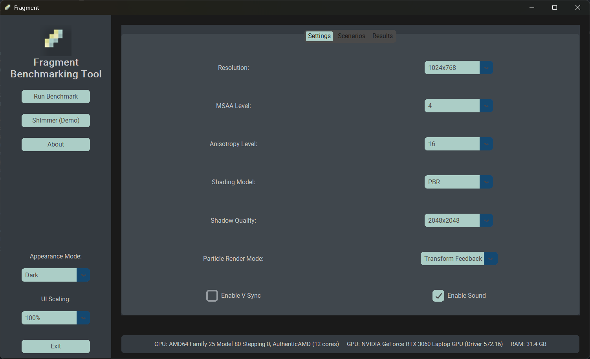
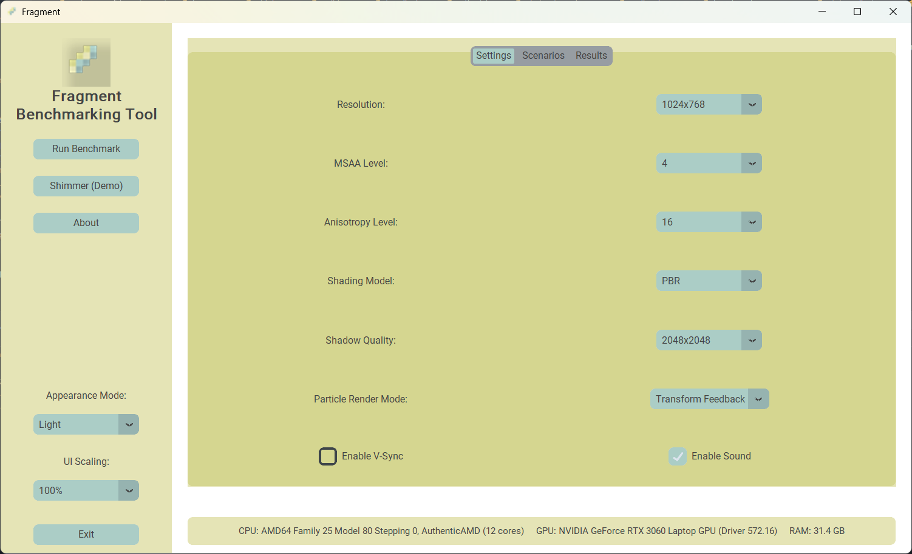
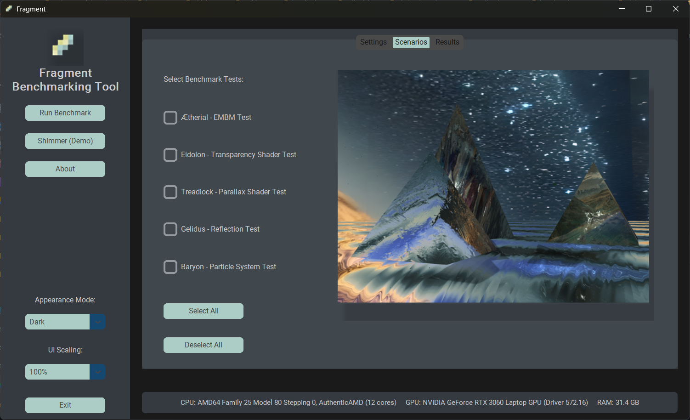
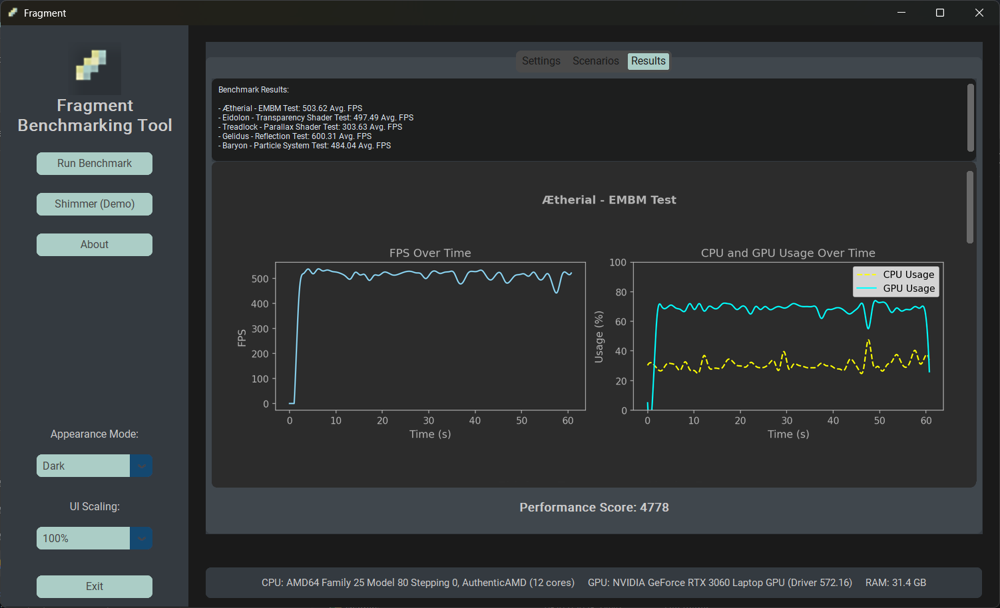
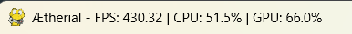

# 🖥️ Fragment

**Fragment** is a **3D rendering benchmark tool** (inspired by *3DMark*) for **PCs** (Windows 11, reasonably new CPU,
OpenGL 3.3+ compatible GPU) and **Raspberry Pi 4 and above** (tested on
*Bookworm*/*Bullseye*). It utilizes **OpenGL** (via *PyOpenGL* and *Pygame*) to stress-test hardware performance,
featuring a **clean graphical interface** and multiple **benchmark modes**.

Built primarily with **'vibe coding'** techniques
using **ChatGPT** and other AI/ML tools for **code assistance** and **asset generation**.

📖 *Read the full write-up on:*  
🔗 [Hackster](https://www.hackster.io/314reactor/fragment-opengl-benchmark-for-pc-pi-f877b8) |
🔗 [Electromaker](https://www.electromaker.io/project/view/fragment-opengl-benchmark-for-pc-amp-pi)

## 🎥 See Fragment in Action!

📺 *Watch the demo video on my YouTube channel:*  
🔗 [Fragment - My Custom 3D Benchmark in Action](https://youtu.be/DVsq8HSjJSc)

## 🚀 Features

### 🎮 Benchmark Modes

1️⃣ **Shimmer** – A demo combining multiple features, including **particle effects** and **ambient audio**.  


2️⃣ **Ætherial** – **EMBM shader test** using a **pyramid model**.  


3️⃣ **Eidolon** – Tests **transparency** and **planar camera effects** using **EMBM shaders** on spherical models.  


4️⃣ **Treadlock** – **Parallax mapping test** with a **spotlight** on a detailed **tire model**.  


5️⃣ **Gelidus** – **Reflection test** using **cubemap-reflective water surfaces**.  


6️⃣ **Baryon** – A **particle system benchmark** supporting **CPU, Transform Feedback, and Compute Shader modes**.  


## 🎨 User Interface

  


- 🛠️ **Select benchmarks, configure settings, and preview scenarios.**
- 🎛️ **Customize graphical settings**, including **MSAA, anisotropy, shading models, and resolution.**
- 📊 **View performance results** with **clean, interactive matplotlib charts.**

  


- 📡 **Track FPS, CPU, and GPU usage** in **real-time** via the window title bar.



---

## ⚡ Rendering & Performance

- 🎨 **Rendering:** Supports **Diffuse, Phong, and PBR shading**, as well as **parallax and shadow mapping.**
- 📈 **Performance Tracking:** Displays **real-time FPS, CPU, and GPU usage** in the window title bar.
- 🔧 **Graphical Settings:** Adjust **resolution, MSAA, anisotropic filtering, shading models, and shadow quality.**
- 🏆 **Performance Score:** Calculates an **aggregated FPS-based rating** across benchmarks.

---

## 🏗️ Architecture

- 🔄 **Abstract Renderer:** Manages **shaders, textures, cubemaps, camera controls, and lighting.**
- 🏗️ **Benchmark Construction:** Easily integrate **model, surface, particle, and skybox-based benchmarks.**

## ⚙️ Installation

### 🔧 Prerequisites

- 🐍 **Python 3.10+**
- 📦 **Required Dependencies:**  
  `PyOpenGL, Pygame, Matplotlib, NumPy, Pillow, psutil, GPUtil, CustomTkinter` - Full list in `requirements.txt`
- ⚠️ **Note:** `PyOpenGL-accelerate` is excluded on ARM systems for Raspberry Pi compatibility:

  ```sh  
  PyOpenGL-accelerate==3.1.7; "arm" not in platform_machine and "aarch" not in platform_machine  
  ```  

---

### 🚀 Setup

On Windows for some dependencies, you may need to install the **Microsoft Visual C++ Redistributable**:

🔗 [Follow the instructions here to install](https://www.scivision.dev/python-windows-visual-c-14-required/)

Clone the repository and install dependencies within a Python Virtual Environment:

```sh  
git clone https://github.com/LordofBone/fragment.git  
cd fragment  
virtualenv venv
source venv/bin/activate
pip install -r requirements.txt  
```  

---

### 🍓 Raspberry Pi Configuration

Run the following scripts to configure Fragment on Raspberry Pi:

```sh  
chmod +x setup/rpi_setup.sh && ./setup/rpi_setup.sh  
chmod +x setup/rpi_bashrc_setup.sh && ./setup/rpi_bashrc_setup.sh  
```  

📌 **What these scripts do:**

- `rpi_setup.sh` installs **libosmesa6** and sets up the required environment variables (**PYOPENGL_PLATFORM** and
  **MESA_GL_VERSION_OVERRIDE**) for Fragment to run on Raspberry Pi.
- `rpi_bashrc_setup.sh` adds the necessary environment variables to **.bashrc**, ensuring they persist across sessions.

💡 *In most cases, running `rpi_setup.sh` is enough. However, if you encounter issues, try running `rpi_bashrc_setup.sh`
as well. (May need a reboot).*

### 🐳 Docker / noVNC

Prefer a containerized workflow or need to run Fragment on a headless machine? A
step-by-step Docker/noVNC guide is available in
[`docs/docker.md`](docs/docker.md). It covers:

- ✅ **Prerequisites** such as Docker 24+, NVIDIA drivers, and the NVIDIA Container
  Toolkit.
- 🖥️ **Supported host platforms** (Linux, Windows 11 via WSL2, and GPU-enabled cloud
  VMs), plus platform-specific caveats.
- 🛠️ **Building or pulling the noVNC image**, along with example `docker compose` and
  `docker run` commands that expose the web UI at `http://localhost:8080/vnc.html`.
- 🎛️ **Runtime customization**, including GPU pass-through flags, optional volume mounts
  for benchmark results, and environment toggles such as `PYOPENGL_PLATFORM` and
  `MESA_GL_VERSION_OVERRIDE`.

Head over to the guide to get started with the containerised setup in minutes.

## 🚀 Usage

> ⚠️ **Caution:**  
> Fragment is resource-intensive and may put a significant load on your hardware—especially on systems like the
> Raspberry Pi—leading to **excessive heat buildup** (particularly on the GPU).  
> Please ensure **adequate cooling** is in place before running Fragment, and use the software at your own risk.  
> Note that Fragment is still in development and may exhibit memory leaks or other bugs, so proceed with caution.

---

### ▶️ Running the Benchmark

Run the benchmark tool:

```sh  
python main.py  
```  

Within the **GUI**, you can:

- 🎛️ **Select and configure benchmark tests.**
- 🎨 **Adjust graphical settings**, such as **MSAA, anisotropy, shading models, and resolution.**
- 📊 **Track live performance data** and **view results in Matplotlib charts.**

---

### 📌 Performance Score Disclaimer

⚠️ **Note:**  
Fragment's results should **not** be taken as totally accurate as a comparison between systems/configurations.  
The performance score is currently a **rough estimate** and calculated as:

`performance_score = overall_avg_fps * 10`

Since **Fragment is still a work-in-progress (WiP)**, results may **vary** between different runs of the same
benchmarks.

---

## 🧪 Testing

Fragment includes a **headless test suite** using `unittest` and `pytest` to validate core functionality, including:

- ✅ **Configuration parsing** and **renderer operations.**
- 🎥 **Camera interpolation** and **performance data collection.**
- 🎵 **Benchmark execution**, **audio playback**, and **GUI logic.**

---

### 📂 Running Tests

To execute the test suite and generate an **HTML report** under the `/report` directory, run:

```sh  
pytest --html-report=./report/report.html
```  

Alternatively, use **unittest** (without generating a report):

```sh  
python -m unittest discover -s tests  
```  

The generated **HTML report** provides a **structured overview** of test results for easier debugging.

## ⚠️ Known Issues

### 🖥️ Raspberry Pi Compatibility

- Fragment **may not work** on all **Raspberry Pi models** or **OS versions** due to OpenGL limitations.
  - ✅ **Tested on:** **Raspberry Pi 4 and above (Bookworm/Bullseye)**
  - 🔧 Use the provided **setup scripts** to ensure compatibility with Raspberry Pi (Bookworm/Bullseye).

---

### 🛑 Memory Leaks

- 🚨 **Memory leaks may occur, especially on Raspberry Pi.**
- 🔄 Running benchmarks repeatedly (**especially the demo**) may cause **out-of-memory issues.**
- 🛠️ These issues are under investigation and will be addressed over time.

---

### 💨 Particle System Issues

- 🎥 **Particles are locked to the camera position,** causing them to move with it.
- 🎮 **CPU Mode:** Particles **spawn in a different location** compared to other modes.
- 🔄 **Ground plane rotation** for particles **does not always work as expected.**
- 🍓 **Raspberry Pi (Bookworm/Bullseye) Specific Issues:**
    - Particles **do not render identically** to the PC version and appear visually different.
    - Only **`GL_POINTS`** works for particle rendering; other primitive types **fail under `glDrawArrays`**.

---

### 🎨 Graphics Limitations (Raspberry Pi)

- ❌ **8× MSAA is unsupported** due to GPU limitations.
- ❌ **Compute Shader mode does not function** on Raspberry Pi.

---

### 🔆 Shadow Mapping Issues

- ⚠️ **Setting `far_plane` too high** can **break shadow mapping**, leading to rendering issues.

---

### 🌈 Tone Mapping & Gamma Correction

- These functions **currently do not work,** resulting in a **washed-out image**.
- ⚠️ **All lighting is currently rendered in SDR.**

---

### 🏆 Performance Score

- The **calculated performance score is an approximation** and may **not accurately reflect** system performance.

---

### 🖥️ GUI Behavior (Raspberry Pi - Bookworm/Bullseye)

- After running the **demo**, the GUI **incorrectly navigates** to the **results screen** instead of returning to the
  **current tab**.
- ⚠️ **GUI tests flash briefly on Linux (on Raspberry Pi), which may also be causing them to be skipped on GitHub
  Actions.**
- ❌ **Application may not exit properly** when clicking the **X button** in the window bar.
  - 🖥️ **Affects:** Windows & Raspberry Pi (Bookworm/Bullseye).
  - 🔧 **Workaround:** Press **`Ctrl + C`** in the terminal to force exit.

---

### 📊 GPU Usage Measurement

- 🔍 **Only NVIDIA GPU usage percentage can be measured** *(limitation of GPUtil, will look into ways of measuring
  AMD/ARM GPU's in future).*

## 🏗️ Adding New Benchmarks

Fragment allows users to **create and integrate custom benchmark scenarios**. This guide provides a quick overview of:

- ✅ **Adding new benchmarks**
- ✅ **Configuring them**
- ✅ **Ensuring they appear correctly in the GUI**

---

### 1️⃣ Creating a Benchmark Script

All benchmarks are stored under the **`/benchmarks/`** directory. Each benchmark should have a
**separate Python script** implementing its logic.

#### 📂 Example Structure:

Create a new benchmark script **`my_new_benchmark.py`** inside **`/benchmarks/`**.  
The script should define a **`run_benchmark`** function, similar to the **Shimmer (Demo)** scenario.

---

## 📝 Example Benchmark Script

This example demonstrates how to create a new **benchmark scenario** using **Fragment**.  
The script sets up a **rotating pyramid model** with:

- 🌟 **Ambient lighting**
- 🕶️ **Shadows**
- 🎵 **Background audio**

```python  
import os
from components.renderer_config import RendererConfig
from components.renderer_instancing import RenderingInstance
from config.path_config import (
    diffuse_textures_dir,
    normal_textures_dir,
    displacement_textures_dir,
    models_dir,
    audio_dir,
)


def run_benchmark(
        stats_queue=None,
        stop_event=None,
        resolution=(800, 600),
        msaa_level=4,
        anisotropy=16,
        lighting_mode="pbr",
        shadow_map_resolution=2048,
        particle_render_mode="vertex",
        vsync_enabled=True,
        sound_enabled=True,
        fullscreen=False,
):
    # Initialize base configuration for the renderer  
    base_config = RendererConfig(
        window_title="New Benchmark",  # Sets the window title  
        window_size=resolution,  # Defines resolution (width, height)  
        vsync_enabled=vsync_enabled,  # Enables or disables V-Sync  
        fullscreen=fullscreen,  # Runs in fullscreen mode if enabled  
        msaa_level=msaa_level,  # Sets anti-aliasing level (0, 2, 4, 8)  
        duration=60,  # Benchmark runtime duration (seconds)  

        # Camera configuration  
        camera_positions=[
            (4.5, 2.85, -1.4, 108.0, -24.0),
            # (x, y, z, rotation_x, rotation_y), add more positions for a camera path  
        ],
        lens_rotations=[0.0],  # Adjusts lens roll angle  
        auto_camera=True,  # Enables automatic camera movement  
        fov=90,  # Field of view  
        near_plane=0.1,  # Minimum rendering distance  
        far_plane=1000,  # Maximum rendering distance  

        # Global lighting settings  
        ambient_lighting_strength=0.60,  # Adjusts scene-wide ambient lighting intensity  
        ambient_lighting_color=(0.216, 0.871, 0.165),  # Greenish ambient lighting  

        # Directional light (acts like a sun)  
        lights=[
            {
                "position": (50.0, 50.0, 50.0),  # Light source position  
                "color": (0.992, 1.0, 0.769),  # Warm light color (soft yellow)  
                "strength": 0.8,  # Light intensity  
                "orth_left": -100.0,  # Shadow projection bounds  
                "orth_right": 100.0,
                "orth_bottom": -100.0,
                "orth_top": 100.0,
            },
        ],

        # Rendering settings  
        lighting_mode=lighting_mode,  # "pbr", "phong", or "diffuse" shading  
      apply_tone_mapping=False,  # Applies tone mapping for HDR rendering (currently does not work)
      apply_gamma_correction=False,  # Applies gamma correction for color accuracy (currently does not work)
        shadow_map_resolution=shadow_map_resolution,
        shadow_strength=1.0,  # Controls shadow darkness  
        anisotropy=anisotropy,  # Anisotropic filtering  
        move_speed=0.2,  # Camera movement speed  
        culling=True,  # Enables back-face culling  

        # Audio settings  
        sound_enabled=sound_enabled,  # Enables or disables background audio  
      background_audio=os.path.join(audio_dir, "music/test.wav"),  # Background music path  
        audio_delay=0.0,  # Delays background audio start  
        audio_loop=True,  # Loops background music  
      debug_mode=False,  # Enables debug mode for additional console output and screenshots of planars and depth maps
    )

    # Define a 3D model (Pyramid)  
    model_config = base_config.add_model(
        obj_path=os.path.join(models_dir, "pyramid.obj"),  # Path to 3D model  
        texture_paths={
            "diffuse": os.path.join(diffuse_textures_dir, "metal_1.png"),  # Base color texture  
            "normal": os.path.join(normal_textures_dir, "metal_1.png"),  # Normal map  
            "displacement": os.path.join(displacement_textures_dir, "metal_1.png"),  # Height map  
        },
        shader_names={
            "vertex": "standard",  # Vertex shader  
            "fragment": "embm",  # Fragment shader (EMBM = Environment-Mapped Bump Mapping)  
        },
    )

    # Create a rendering instance  
    instance = RenderingInstance(base_config)
    instance.setup()

    # Add the pyramid model to the scene  
    instance.add_renderer("main_model", "model", **model_config)

    # Scene transformations for the pyramid model  
    instance.scene_construct.translate_renderer("main_model", (0, 0, 0))  # Moves model to (x, y, z)  
    instance.scene_construct.rotate_renderer("main_model", 45, (0, 1, 0))  # Rotates model (degrees, (x, y, z))  
    instance.scene_construct.scale_renderer("main_model", (1.2, 1.2, 1.2))  # Scales model uniformly  (x, y, z)

    # Enable automatic rotation for the model  
    instance.scene_construct.set_auto_rotation("main_model", True, axis=(0, 1, 0), speed=2000.0)
    # - `True` enables auto-rotation  
    # - `axis=(0, 1, 0)` means rotation around the Y-axis  
    # - `speed=2000.0` controls rotation speed  

    # Start the benchmark  
    instance.run(stats_queue=stats_queue, stop_event=stop_event)  
```

---

## ✅ Key Features Explained

### 🎨 Rendering Configuration

- 🖥️ **Resolution & MSAA:** Defines the **screen size** and **anti-aliasing level**.
- 💡 **Lighting & Shadows:** Uses **ambient and directional lighting**, with **adjustable shadow quality**.
- 🎵 **Audio Support:** Background music can be **looped or disabled** via settings.
- 🎥 **Automatic Camera:** Moves through **predefined positions** for cinematic views.

---

### 🛠️ Scene Manipulation

- 🔀 **Translation (`translate_renderer`)** → Moves objects to a specific **position**.
- 🔄 **Rotation (`rotate_renderer`)** → Rotates an object **around an axis**.
- 📏 **Scaling (`scale_renderer`)** → Enlarges or shrinks objects **uniformly or non-uniformly**.
- 🔃 **Auto-Rotation (`set_auto_rotation`)** → Makes an object **continuously rotate**.

📌 This guide ensures a **clear understanding** of each parameter when adding new benchmarks. 🚀

---

## 🐛 Debug Mode

Fragment includes a **debug mode** to assist with troubleshooting.  
By enabling `debug_mode`, you can access **additional console output** and **automated screenshots** of
**planar camera views** and **depth maps**.

### 🔧 Enabling Debug Mode

To enable debug mode in a **benchmark script**, modify its **`base_config`**:

```python  
base_config = RendererConfig(
  window_title="New Benchmark",
  resolution=(800, 600),
  debug_mode=True,  # Enables additional debug output and screenshot captures  
)  
```

### 🛠️ Debug Mode Features

- 📝 **Additional console output** – Logs rendering details and potential issues.
- 📷 **Screenshots saved to** `/screenshots/`:
  - **Planar camera captures** – Useful for debugging camera perspectives.
  - **Depth maps** – Helps visualize shadow and occlusion data.

✅ **Why use it?**  
Debug mode helps **view logs**, **analyze rendering issues**, and **verify depth mapping & planar camera outputs**.

---

## 2️⃣ Registering the Benchmark in the GUI

To add the **new benchmark** to the **menu**, modify **`/gui/main_gui.py`**, where benchmarks are registered:

```python  
from benchmarks.my_new_benchmark import run_benchmark as run_new_benchmark

BENCHMARKS = {
    "New Benchmark - Example Test": run_new_benchmark,
}  
```  

✅ **Key Points:**

- 📥 **Import** the new benchmark function.
- 📌 **Add an entry** to the `BENCHMARKS` dictionary.
- 🏷️ **Ensure the name is descriptive** for clarity in the UI.

---

### 🖼️ 3. Adding a Preview Image

To ensure the **GUI displays a preview**, place a **reference image** in:

📂 **`/docs/images/`**

- 🏷️ **Name the image exactly** as the benchmark title in the **GUI `BENCHMARKS` dictionary**.
- 📌 **Example:** If the benchmark is named `"New Benchmark - Example Test"`, the image should be:  
  **`New Benchmark - Example Test.png`**

✅ **Key Points:**

- 📝 The **image filename must match the benchmark title** in the GUI.
- 🖼️ The **image appears when users hover** over the benchmark in the GUI.
- 🔳 **PNG format is preferred** for consistency.

---

### 🏃‍♂️ 4. Running and Testing

After adding the new benchmark, follow these steps:

1️⃣ **Run it via the GUI:**

- ▶️ Start the application:

  ```sh  
  python main.py  
  ```  

- 🖥️ Navigate to the **Scenarios** tab.
- 🏆 Select the **new benchmark** and run it.

2️⃣ **Verify the results:**

- 📊 Ensure **FPS, CPU, and GPU usage data** are recorded.
- 🖼️ Check that the **preview image appears correctly**.

---

### 🔄 5. Committing and Contributing

If contributing to the **main repository**:

- ✅ **Ensure code passes linting and tests:**

  ```sh  
  pytest --html-report=./report/report.html  
  ```  

- ✅ **Submit a Pull Request (PR):**
    1. 🔀 **Fork the repository.**
    2. 📂 **Add your benchmark** under **`/benchmarks/`**.
    3. 🖼️ **Update the GUI** and **add a preview image**.
    4. 🔧 **Open a PR** with a description of the new benchmark.

---

### 📌 Summary

✔️ **Create a new benchmark script** under **`/benchmarks/`**.  
✔️ **Configure rendering** using **`RendererConfig`**.  
✔️ **Register the benchmark** in **`/main.py`**.  
✔️ **Add a preview image** under **`/docs/images/`**.  
✔️ **Test manually and via the GUI**.  
✔️ **Ensure code follows standards** before submitting a PR.

📌 This workflow ensures **new benchmarks** are properly **integrated** and **accessible in the GUI** for testing and
comparison. 🚀

---

## ⚙️ GitHub Actions & Contribution Workflow

Fragment uses **GitHub Actions** to automate **linting, testing, and version management**.  
These workflows help maintain **code quality** and ensure a **structured versioning system**.

---

### 🛠️ Linting, Formatting, and Testing (`lint_and_test.yml`)

This workflow runs on **every pull request**, ensuring that contributions **meet coding standards** and
**pass all tests** before merging.

#### 🔄 Steps:

1️⃣ **Checkout Repository** – Fetches the latest code.  
2️⃣ **Set Up Python** – Installs **Python 3.10**.  
3️⃣ **Install Dependencies** – Installs **required development dependencies**.  
4️⃣ **Run Ruff Linting & Formatting** –

- 📏 **Lints the code** with **Ruff** and **auto-fixes issues**.
- ✅ **Ensures formatting is correct**.  
  5️⃣ **Auto Commit Linting Fixes** – 📝 Automatically commits any formatting fixes.  
  6️⃣ **Run Unit Tests** – Executes tests using **pytest** and generates an HTML report *(not available on GitHub Pages
  yet)*.

---

🔹 *Why this matters:*  
Ensuring that **contributors follow consistent coding practices** helps maintain project quality.  
All **pull requests** are **automatically checked** before merging. 🚀

---

### 🔄 Automatic Versioning & Tagging (`tag_and_bump_on_merge.yml`)

When a **pull request** is merged into the **`main`** branch, this workflow automatically:

- ✅ Bumps the **version number**
- ✅ **Tags** the new release
- ✅ Ensures a **structured versioning process**

---

### 🔧 Steps:

1️⃣ **Checkout Repository** – Ensures full commit history is available.  
2️⃣ **Set Up Python** – Installs **Python 3.10**.  
3️⃣ **Install bump2version** – A tool for managing **semantic versioning**.  
4️⃣ **Determine Version Bump Level:**

- 📊 Analyzes the number of **code changes (`git diff HEAD^`)**.
- Determines whether to increment the **patch**, **minor**, or **major** version:
    - 🟢 **Patch:** Changes **< 250 lines**.
    - 🟡 **Minor:** Changes **between 250–2000 lines**.
    - 🔴 **Major:** Changes **≥ 2000 lines**.  
      5️⃣ **Bump Version** – Updates the **version number** in the codebase.  
      6️⃣ **Auto Commit Version Update** – 📝 Commits the version bump change.  
      7️⃣ **Create a Git Tag** – Uses the updated **version number** as a tag *(e.g., `v1.2.3`)*.  
      8️⃣ **Push Tag to Repository** – Ensures the new **version is officially recorded**.

---

🔹 *Why this matters:*

- 📌 Maintains a **structured versioning approach**.
- 🏷️ Allows **easy tracking** of changes over time.
- 🚀 Ensures **new releases** are properly tagged **without manual intervention**.

---

## 🔄 Contribution Workflow with GitHub Actions

This workflow ensures that **every contribution** is:  
✅ **Checked** (linting, formatting, and tests)  
✅ **Formatted automatically** (if needed)  
✅ **Versioned properly** before deployment

---

### 🛠️ Steps to Contribute

1️⃣ **Create a Feature Branch**

- 🌱 Make changes in a **new branch** based on `main`.

2️⃣ **Submit a Pull Request**

- 🔍 The **lint and test workflow** runs automatically.
- 🛠️ Any necessary fixes (**linting, formatting**) are **auto-applied and committed**.

3️⃣ **Merge to Main**

- ✅ Once **approved**, merging triggers the **tag and version bump workflow**.
- 🔄 The repository is **updated** with a **new version number** and **Git tag**.

---

🚀 This **automation** ensures that every contribution is **properly validated, formatted, and versioned** before
deployment!

---

### 📌 Notes for Contributors

- 🔄 **Always pull the latest changes** from `main` before starting a new feature.
- 🛠️ **If your pull request fails** please see the output of the tests/linting and apply+push the changes.
- 🔢 **The versioning system is automated** – no need to manually update version numbers.

✅ By following this workflow, contributions remain **clean, consistent, and efficiently versioned.** 🚀

---

## 📜 License

Fragment is licensed under the **GNU General Public License (GPL)**.  
See the [LICENSE](LICENSE) file for details.

---

## 🙌 Acknowledgements

**Fragment** is inspired by benchmarks like **3DMark** and **Unigine** and is built using:  
🖥️ **PyOpenGL, Pygame, Matplotlib, and other Python libraries via PIP.**

### 🔧 Additional tools and resources used during development:

- 🤖 **ChatGPT** – Assisted with the **Python/GLSL codebase**, **object** and **texture generation**.
- 🎨 **[Material-Map-Generator](https://github.com/joeyballentine/Material-Map-Generator)** – Used to generate **normal,
  roughness, and height maps** for textures.
- 🎵 **[AudioLDM2](https://github.com/haoheliu/AudioLDM2)** – Used for generating **ambient music** in demo mode.
- 🖼️ **[sphere2cube](https://pypi.org/project/sphere2cube/)** – Converted **ChatGPT-generated images into cubemaps**.
- 📷 **[Real-ESRGAN](https://github.com/xinntao/Real-ESRGAN)** – Used for **upscaling images** to higher quality.